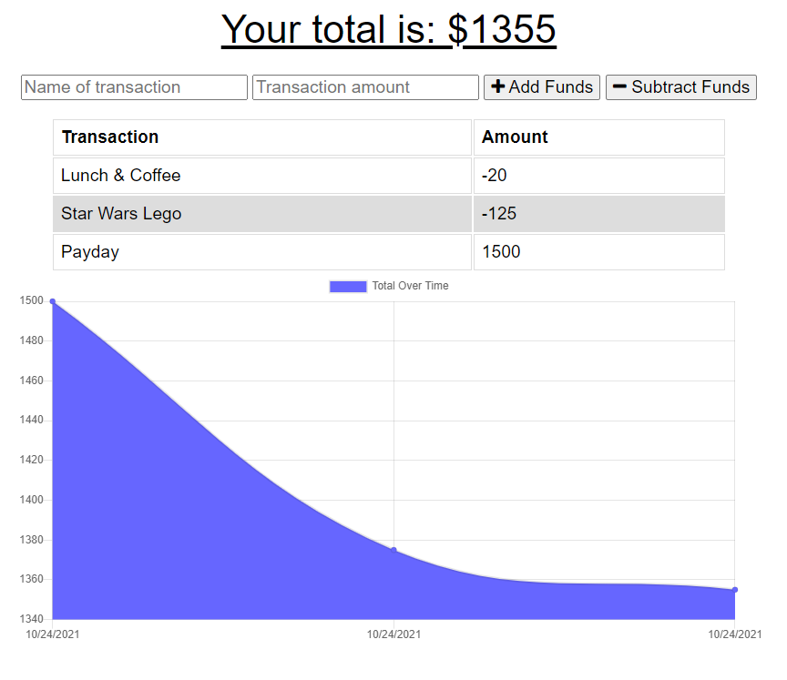

<h1 align="center">Progressive Budget Tracker</h1>
<h2 align="center">MongoDB & IndexedDB</h2>

## Description

This application allows a user to maintain visibility of their budget even when they are without internet connection. Data is persisted by a MongoDB backend and leverages IndexedDB for caching "offline" transactions. The application is deployed to Heroku and can be found here: [Budget Tracker](https://radiant-wave-66486.herokuapp.com/)

## Table of Contents

- [Usage](#usage)
- [License](#license)
- [How to Contribute](#how-to-contribute)
- [Questions](#questions)

## Usage

[Budget Tracker](https://radiant-wave-66486.herokuapp.com/)

This single-page application presents the user's current budget with a form providing the ability to add new deposit (Add Funds) or expense (Subtract Funds) transactions. Historical transactions are shown in both a table and chart. The main feature of this application is that if the user is without internet connection, they are still able to record transactions into the application in their local session and the budget is updated accordingly. Once internet connection is restored, any "offline" transactions are automatically bulk uploaded to the MongoDB backend for persistent storage.

## License

This application is covered under the MIT license. Information about this license can be found [here](http://choosealicense.com/licenses/mit/).

## How to Contribute

[MichaelHermes](https://github.com/MichaelHermes)

## Questions?

Find me on [Github](https://github.com/MichaelHermes) or email me at [mikehermes87@gmail.com](mailto:mikehermes87@gmail.com).
